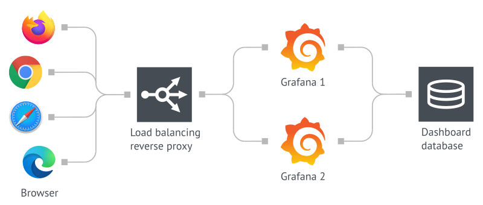

# Grafana High Avialability



### Pre-requisites:
- docker
- docker-compose

### Breakdown:
- Nginx will serve as our Load Balancer.
- PostgreSQL 12 will store our data.

### Quick start:
```bash
docker compose up -d
```
\
Go to [localhost:8080](http://localhost:8080) on your browser.
\
\
Initial grafana sign in details:
|Username|Password|
|--------|:------:|
|admin   | admin  | 
